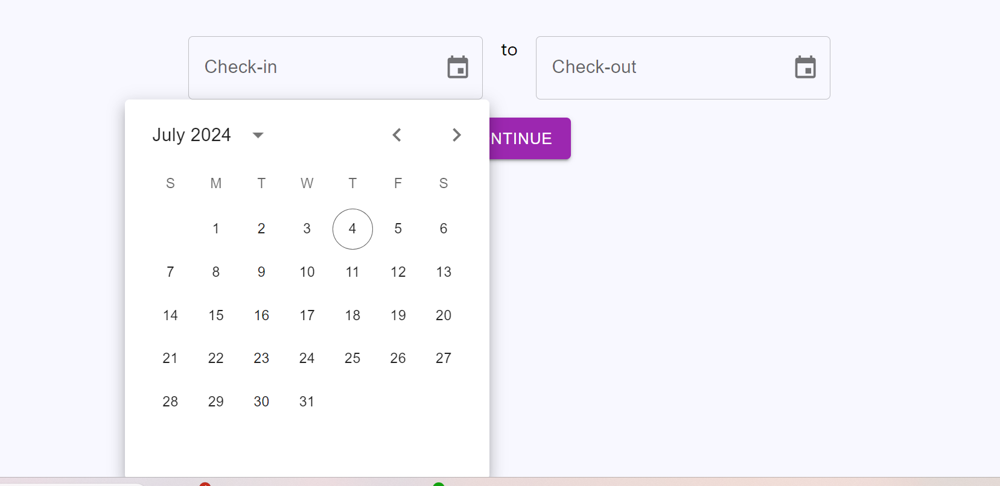

# new-app

Using MUI react app  
	npx create-react-app new-app  
	cd new-app  
	npm install @mui/material @emotion/react @emotion/styled  
	npm install @mui/x-date-pickers  
	npm install date-fns  
	npm install @mui/material @emotion/react @emotion/styled @mui/x-date-pickers date-fns    

**Result: ** 
 
